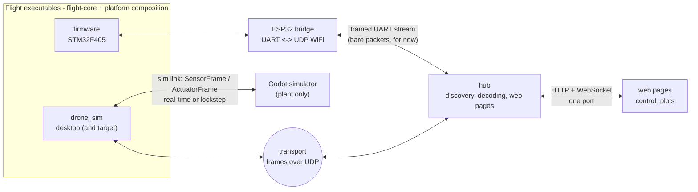
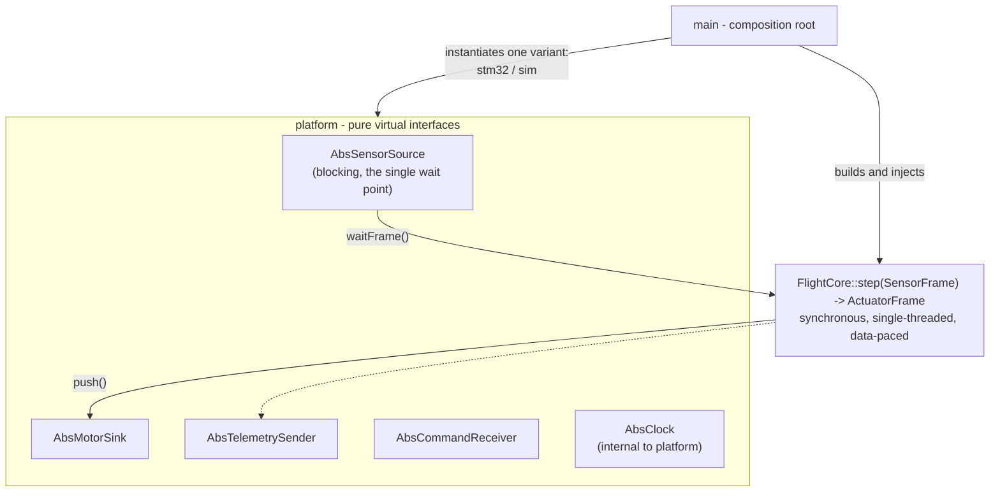

# System architecture - high-level view

Target picture for the project: one flight core embedded everywhere, and
external processes that only speak the network protocol. This document stays
deliberately high level; it will be refined along with the code.

## Overview

- **A single output bus**: the transport (`software/components/transport/`)
  carries every packet between the flight processes and the ground tools as
  a frame with a source and destination node; telemetry is a broadcast
  frame any number of nodes read simultaneously, commands are unicasts to
  the node that beaconed. The board still reaches the hub as bare packets
  through the ESP32 bridge until it migrates.
- **Godot and the hub never link flight-core**: they only know `protocol/`
  (packed structs, versioned from the first byte). The web pages only know
  the hub's JSON over WebSocket/HTTP, never the wire.
- The sim link's **lockstep** mode (the simulator waits for the motor
  response before advancing its physics) buys determinism, faster-than-real-
  time runs and debugger single-stepping.

## Anatomy of a flight executable

Each executable = the same core + a set of services picked in its `main`
(explicit composition root, injection by reference, no singleton):

Structuring principles:

- **flight-core is pure**: no dynamic allocation, no exceptions/RTTI, no
  clock access - the timestamp travels inside the `SensorFrame`, stamped by
  platform at acquisition time.
- **The RC kill switch** is a field of the frame, handled at the very top of
  `step()`.
- **Quaternions everywhere** (arbitrary attitude), `float` everywhere,
  `-Wdouble-promotion` as an error: comparable execution between desktop and
  Cortex-M4F.
- Platform variants are **composable** (e.g. sim-on-target: stm32 clock +
  UART transport + sim sensor source).
