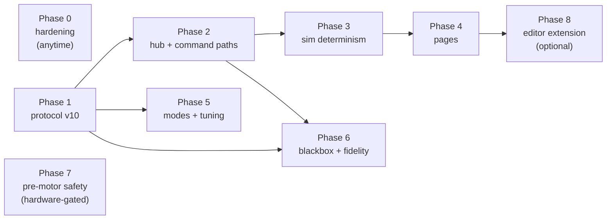

# Implementation plan - reaching the target design

Status: agreed plan, no calendar attached. This document sequences the
work needed to go from the current code to the target described in
`docs/target-architecture.md`, folding in every finding of
`docs/design-audit.md` (coverage table at the end - nothing from the
audit is silently dropped). Finding numbers below (2.1, 4.5, ...) refer
to that audit.

## Principles

- **Two independent tracks.** Phase 0 (hardening) touches existing code
  and can start immediately, in any order, in small commits. Phases 1-6
  (architecture and features) are sequential where arrows say so. Phase 7
  is gated by hardware, not by the other phases.
- **Every phase ends green** (build, tests, lint, CI) and leaves the
  system usable; no big-bang branch.
- **One wire migration.** Every breaking protocol change ships together
  in phase 1; nothing else ever breaks the wire format.
- **Delete as you go.** A tool or script is removed in the same phase
  that makes it redundant, never left to rot.

---

## Phase 0 - Hardening (no dependencies, start anytime)

Small, independent, high-value fixes to existing code. Each bullet is
one or two commits with its tests.

### 0.1 flight-core input contract

- Derive dt and monotonicity once at the top of `step()` and pass it
  down; remove the three per-module copies of the 0.05 s gap policy and
  the unguarded unsigned subtractions in the state machine (2.2, 2.5).
- Scrub NaN/Inf at the `step()` boundary with a defined, tested policy
  (2.3).
- Baro plausibility gate (innovation clamp or validity check) so a
  zeroed or glitched frame cannot poison the vertical loop (2.1).
- Arming hysteresis on the current threshold, as an interim measure
  until the mode redesign of phase 5 (2.7).
- Decide `VerticalEstimator::ready()`: gate the state machine with it or
  delete it; add a baro reference recapture path for the in-air reboot
  case (2.9).
- Make kill-switch state reset explicit and complete
  (`m_tiltExceededSinceUs`), replace the timestamp-zero sentinels with
  explicit bools, split `cutoffTripped` along its real axis (2.10).
- Tests for every gap listed in 2.11: non-monotonic timestamps, baro
  variation and glitches, NaN frames, kill mid-RECOVERY/mid-HOVER,
  RECOVERY timeout, BALLISTIC gyro cutoff, MANUAL mapping,
  VerticalEstimator gap handling. The integration test helper must stop
  flying with a permanent 0 Pa baro (2.1).

### 0.2 platform and app contract fixes

- `waitFrame` becomes tri-state (frame / timeout / exhausted) or the
  timeout policy moves out of the source; `drone_sim` exits nonzero on
  zero frames so a batch run that never connected cannot look green
  (3.1).
- `UdpLink` validates before latching the reply address (3.4).
- Fix `FirmwareApp::init` ordering to honor the declaration-order
  promise; document or fix the WFI race, the clock wrap call-rate
  constraint and the single-instance coupling of `g_ticks` (3.8).
- Deduplicate `sendTelemetry` between drone_sim and drone_replay into
  `platform/src/common/` (3.6; the full telemetry publisher move happens
  in phase 1 with 2.6).

### 0.3 Bench-safety interim guard

Until phase 3 removes the RC port from batch entirely: headless guard
and disable flag on `rc_uplink.gd`, and `run_batch.py` overrides the RC
port like the others (4.3 interim). One evening, closes the only
physical-safety finding.

### 0.4 CI honesty

- `HeaderFilterRegex` so clang-tidy sees headers, including protocol/
  (5.1).
- Run clang-tidy on the stm32 compile database too (5.2).
- Pin CI jobs to the image sha tag; pin Catch2 to a commit SHA (5.3,
  5.4).
- Reconcile the naming rules between the C++ guidelines and .clang-tidy;
  add the project addendum for inapplicable sections (5.6).
- `DRONE_PLATFORM` cache variable instead of the mirrored
  CMAKE_CROSSCOMPILING switches (5.7).
- Cheap 5.8 items: firmware links drone_strict, ci.yml concurrency
  cancellation and timeouts, ASCII/English check script.

Definition of done: all HIGH findings outside sections 4 and hardware
(2.1, 2.2, 3.1, 5.1, 5.2) closed; test count strictly higher; CI green
on a pinned image.

---

## Phase 1 - Protocol v10, one coordinated migration

Everything that breaks the wire format, together, once.

- **Header**: version byte then type byte on every packet; demux by size
  disappears everywhere (4.1).
- **Streams**: sourceId and sequence number on telemetry and sim raw
  (4.5); replay/sim/bridge streams become distinguishable (3.7).
- **Announce packet** (process kind, ports, protocol version) - the
  basis of phase 2 discovery.
- **Command set additions**, defined now even if consumed later: RC gains
  the mode field (phase 5), tuning set/get/list/ack packets (phase 5).
- **Serial framing**: CRC-8/16 replaces XOR-8; the length byte is
  covered (4.7).
- **Blackbox record moves into protocol/**: sync marker, type byte,
  CRC per record, versioned with the rest of the wire (4.4, 2.8);
  content is sensor frames + actuator outputs, extensible to controller
  internals.
- **flight-core purity**: telemetry packer and Blackbox writer move to
  platform; flight-core drops its protocol/ dependency entirely (2.6).
- **Layout guarantees**: static_assert on little-endianness and field
  offsets; document the packed-struct portability assumptions for the
  future ESP32 bridge (4.8).
- **Port defaults centralized** in one protocol/ header (the +2 mirror
  arithmetic dies).
- **Golden-packet fixtures**: a C++ tool emits reference bytes with
  asymmetric field values for every packet type, checked into the repo;
  python and GDScript parsers get CI decode tests against them (4.1).
  Existing consumers are updated minimally - they die in phases 2-4.

Definition of done: one version bump; `PROTOCOL_VERSION` referenced from
exactly one place per language; golden-packet tests green in CI;
flight-core builds without protocol/.

---

## Phase 2 - Hub daemon and unified command paths

- **Hub process** (desktop C++, links protocol/, never flight-core):
  UDP and serial transports, discovery from announce packets, stream
  recording, WebSocket + JSON endpoint. Absorbs `serial_bridge.py` and
  `stream_record.py`, which are deleted (T1, 5.5 partially).
- **Scenario launcher CLI** in the hub: one command per scenario (sim,
  sim lockstep, real board, replay); `run_batch.py` becomes a consumer
  of the launcher instead of spawning processes itself.
- **RC path unification** (3.5, 3.6): an `RcTracker` helper in
  `platform/src/common/` (decode, timeout fail-safe, frame grafting),
  testable on desktop, used by firmware and by a new sim
  `AbsCommandReceiver`. Interactive RC flows hub -> command receiver in
  every composition; the fail-safe path runs in every simulated flight.
  RC leaves the SimSensorPacket.
- `sim_stub.py` stays (test fixture) but consumes the golden-packet
  constants.

Definition of done: a full sim session (Godot + drone_sim + live plots
via any WebSocket client) starts with one command; firmware-over-UART
session works through the hub without `serial_bridge.py`; RC fail-safe
has a desktop test.

---

## Phase 3 - Simulator determinism and batch integrity

- Scenario commands (reset, throw, scripted arming) move in-band onto
  the lockstep link, tick-stamped; `sim_command.gd` and `rc_uplink.gd`
  are deleted - batch no longer touches any RC or command port,
  closing 4.3 structurally.
- Sensor-noise RNG reseeds per run from the run seed; Godot restart gets
  a session identity so a comeback within the idle window cannot freeze
  the core silently (4.2, 4.6).
- Lockstep timeout counter read by the batch runner; runs with timeouts
  are flagged or failed, never silently free-running (4.2).
- Duplicate-timestamp rejection on lockstep resends (4.8).
- Trajectory hash lands in every batch result row; two runs of the same
  seed on the same build must match (reproducibility becomes verified).
- CI gains the headless `--runs 1` batch smoke: the end-to-end
  cross-language wire test (5.5).

Definition of done: same seed + same build = same trajectory hash, and
CI proves a full sim round-trip on every push.

---

## Phase 4 - Pages, deleting the tools they replace

One page at a time, each deleting its predecessor:

1. **Plots** (live and from-file): parity with `ground_station.py`, plus
   sequence-based link health; retires `ground_station.py` and the
   telemetry-parsing Godot scripts (`attitude_compare.gd`). Fixes the
   time-alignment inconsistency between live and offline comparison
   (4.8) by sharing one alignment rule.
2. **Command console**: arm/reset/reboot, RC state display.
3. **Blackbox browser**: list, download (via dump when phase 6 lands),
   decode, plot; retires `blackbox_dump.py` and `stream_compare.py`.
4. **3D attitude** from the telemetry quaternion (three.js).

Definition of done: `tools/` contains only `batch/` (as a launcher
consumer) and `sim-stub/`; Godot contains only plant code.

---

## Phase 5 - Flight behavior: piloting modes and dynamic tuning

Consumes the packet layouts reserved in phase 1.

- **Piloting modes** (target 2.1): manual (throttle min = motors zero)
  and altitude-auto (stick centered = zero vertical speed, stick maps to
  target vertical velocity). Mode locked while armed; per-mode arming
  interlocks (manual: stick down; throw start: altitude-auto with
  throttle centered within a deadband); hysteresis on every boundary.
  Replaces the phase 0 interim hysteresis and closes 2.7 by design.
- **Dynamic tuning** (2.4): static parameter table in flight-core (id,
  value, bounds, armed-change policy), constructor takes the tuning
  struct, `RateController` gains move out of the function body; protocol
  set/get/list/ack wired end to end; hub stores and pushes named
  profiles on connection; tuning page in the UI. Batch campaigns and
  re-execution sweep parameters through the same table without
  recompiling.

Definition of done: mode change refused while armed (tested); a gain
changed from the tuning page alters the next simulated flight without
recompilation; a Monte Carlo sweep varies a gain via the launcher.

---

## Phase 6 - Blackbox on target and fidelity tooling

- **On-board recording**: SD/flash write path for the protocol/ record
  format (write-only medium; DMA buffers outside CCM), full-rate sensor
  frames + actuator outputs, loss counter separate from telemetry
  (3.8 UART funnel).
- **Dump**: firmware command streaming the recording over UART; hub
  writes the file; blackbox browser page consumes it.
- **Re-execution hardening**: recorded real throws become unit-test
  fixtures (regression of detectors against real data); `firmware_hil`
  composition when on-target timing checks become relevant.
- **Fidelity loop** (target 2.5): replay recorded actuator outputs
  through the Godot plant, compare simulated sensor traces against
  recorded ones in a dedicated page; plant parameters (mass, inertia,
  sensor noise, latency) become data. The sensor-model realism gaps
  (latency, vibration coupling, sampling offset - 4.8) are addressed
  here, where they can be measured against reality instead of guessed.
- First fidelity campaign needs no airframe: model the bare board,
  record hand maneuvers, match the traces.

Definition of done: a real recording dumped, browsed, re-executed on
desktop and compared against the plant, end to end through the hub.

---

## Phase 7 - Pre-motor safety gate (hardware-gated)

Must be complete before an ESC is ever connected; independent of phases
1-6.

- Watchdog covering the flight loop, with a designed home in the App
  pattern; fault handlers that force motors safe before anything else
  (3.3).
- I2C runtime error handling: BERR/ARLO cleared, DWT-calibrated
  timeouts, in-flight bus recovery, bounded stale-sample tolerance with
  escalation to fail-safe (3.2).
- Flash/latency budget: LTO evaluation and a size check in CI (5.8).

Definition of done: a deliberately wedged I2C bus and a forced HardFault
both end with motors safe and a blackbox trace, on the bench.

---

## Phase 8 - Optional thin editor extension

Only if the browser workflow proves insufficient: a tree view calling
the launcher CLI plus webviews embedding the existing hub pages. No
protocol knowledge, no business logic (target 3.6 stays true).

---

## Audit coverage table

Every audit finding and where this plan handles it. "Backlog" means
consciously deferred, with the reason.

| Finding | Phase | Note |
| --- | --- | --- |
| 2.1 baro poisoning | 0.1 | plus test-helper fix |
| 2.2 timestamp wrap | 0.1 | dt owned once in step() |
| 2.3 NaN to motors | 0.1 | |
| 2.4 tuning ownership | 5 | table + struct + wire |
| 2.5 dt triplication | 0.1 | merged with 2.2 |
| 2.6 packer/Blackbox in core | 1 | purity restored |
| 2.7 arming chatter/handoff | 0.1 interim, 5 final | modes remove the discontinuity |
| 2.8 blackbox tear resilience | 1 | marker + type + CRC per record |
| 2.9 ready() gates nothing | 0.1 | decide: gate or delete |
| 2.10 sentinels, kill reset, predicate | 0.1 | |
| 2.11 test gaps | 0.1 | one test per gap |
| 3.1 waitFrame tri-state | 0.2 | plus nonzero exit on zero frames |
| 3.2 I2C escalation | 7 | pre-motor gate |
| 3.3 watchdog/faults | 7 | pre-motor gate |
| 3.4 UdpLink latch | 0.2 | validate before latch |
| 3.5 RC fail-safe unexercised | 2 | RcTracker + sim command receiver |
| 3.6 empty common/ | 0.2 + 2 | sendTelemetry then RcTracker |
| 3.7 replay port collision | 1 + 2 | sourceId + discovery |
| 3.8 lifecycle, WFI, wrap, g_ticks, UART funnel | 0.2 + 6 | funnel counter in 6 |
| 4.1 wire duplication, size demux | 1 | type byte + golden packets |
| 4.2 seed reproducibility | 3 | in-band commands, reseed, hash |
| 4.3 batch RC at real board | 0.3 interim, 3 final | structural removal |
| 4.4 blackbox bypasses protocol/ | 1 | |
| 4.5 no seq/sourceId | 1 | |
| 4.6 Godot restart | 3 | session identity |
| 4.7 XOR-8 framing | 1 | CRC |
| 4.8 endianness, broadcast, alignment rule, stub doc, resends, realism | 1 + 3 + 4 + 6 | split as noted; LAN broadcast: backlog, revisit with discovery |
| 5.1 tidy headers | 0.4 | |
| 5.2 tidy stm32 | 0.4 | |
| 5.3 :latest image | 0.4 | |
| 5.4 Catch2 pinning | 0.4 | |
| 5.5 python/CI blind spot | 2 + 3 | tools die; batch smoke lands |
| 5.6 guidelines vs tidy | 0.4 | |
| 5.7 CROSSCOMPILING conflation | 0.4 | |
| 5.8 LTO/size, flags fragility, strict firmware, ci.yml hygiene, ASCII check, devcontainer trigger | 0.4 + 7 | flags-init note and devcontainer trigger: backlog (low risk, low cost to fix when touched) |
