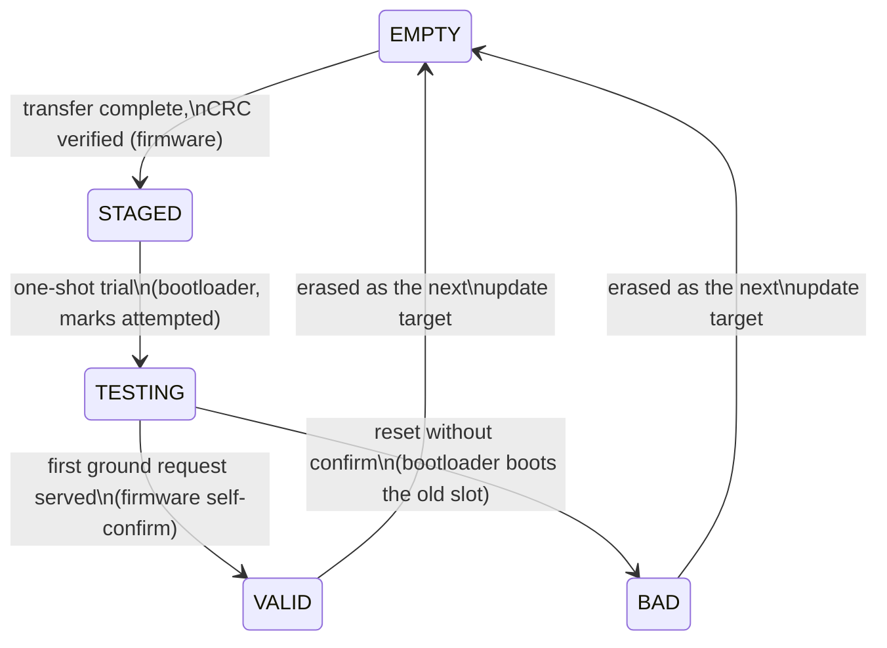
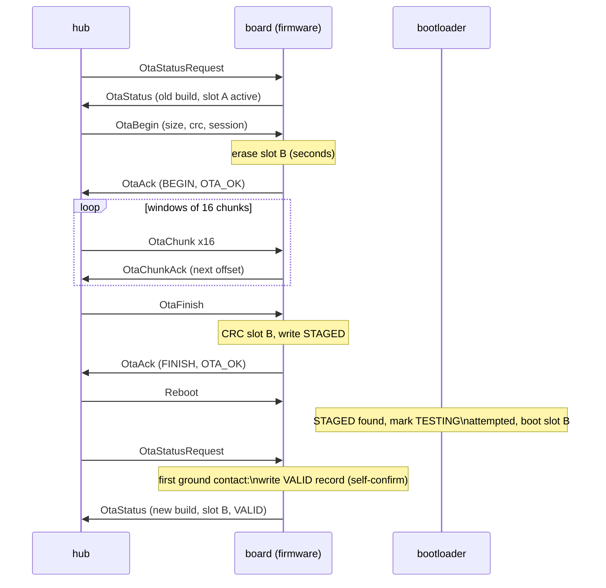

# OTA firmware update - design proposal

Status: implemented (the Ota* messages of mark4.proto, protocol/ota_image.hpp, platform firmware stores, OtaUpdater,
drone_boot, scripts/make_ota.py, hub OtaClient and the update panel; the
desktop end-to-end test drives a full update and a rollback against
drone_sim). This document remains the reference for the design decisions.
Companions: `docs/target-architecture.md` (system picture this plugs into),
`docs/bring-up.md` (mark1 board), `docs/aio-board-spec.md` (F722 AIO board).

## 1. Goal and scope

Reflash `drone_firmware` from the hub, over the radio path that already
exists, with no cable and no debug probe, and with the guarantee that no
event during the update - power cut, lost link, corrupted transfer, or a
new image that does not boot - ever leaves the board unable to run the
previous firmware. The guarantee comes from a dual-bank layout: two
firmware slots in flash, the running one never touched by the update path,
a small bootloader that picks between them.

In scope: the STM32 flight firmware, on both boards (mark1 F405 today,
AIO F722 next). Out of scope for v1, listed with reasons in section 7:
updating the bootloader itself, updating the ESP32 bridge, image signing,
resuming an interrupted transfer, delta updates.

## 2. The path the bytes take, and what it imposes

```
hub (desktop) --UDP/WiFi--> ESP32 bridge --UART 921600--> flight controller
```

- **The bridge stays a cable.** It carries bytes and never looks at them,
  so OTA needs zero bridge changes: the hub sends wire envelopes as
  transport unicasts to the board's node, the transport frames them for
  the bridge link in the serial framing (transport header, then the
  envelope), the bridge forwards the bytes, the board's `UartLink` picks
  them up. The board is a transport node like `drone_sim`; the hub has no
  special serial path and sends no hello byte (its beacon teaches the
  bridge its peer). This is the payoff of the "it is a cable" decision and
  the proposal keeps it intact.
- **The serial framing caps a frame at 512 payload bytes** (two length
  bytes) and discards corrupted frames by CRC-16. WiFi loses datagrams.
  The transfer protocol must therefore retransmit, and must pace itself:
  the receiver's acknowledgements are the flow control that keeps the hub
  from overrunning the bridge's UART transmit side (the UART is the
  bottleneck at roughly 92 KB/s).
- **Flash on both MCUs is single-bank at the silicon level**: programming
  or erasing stalls every code fetch from flash. So the update runs in a
  dedicated update mode with the flight loop stopped, and UART reception
  must sit on a DMA circular buffer, which keeps capturing while the CPU
  is stalled.
- **Two chips, one logic.** mark1 carries an STM32F405 (1 MB flash); the
  AIO board an STM32F722 (512 KB flash, plus a 16 MB W25Q128 NOR). The
  slot geometry is per-chip data; every
  state machine, packet and tool is shared.

## 3. Functional proposal

### 3.1 A nominal update, as the operator sees it

1. **Build.** `python3 scripts/build_app.py drone_firmware` produces, next
   to the elf, one `drone_firmware.ota` bundle: the image linked for slot
   A, the image linked for slot B, and a manifest (build epoch, git
   hash, target MCU). The build epoch is the identity of a build: unlike
   the git hash it tells two packagings of the same dirty tree apart.
2. **Connect.** The drone sits on the bench, disarmed, bridge powered. The
   hub control page already shows the board; it now also shows the running
   build and which slot it runs from (one status request).
3. **Start.** The operator picks the bundle (the hub offers the most
   recent build by default) and clicks update. The hub checks the manifest
   against the board (right MCU, right protocol version) and shows what is
   about to replace what.
4. **Transfer.** The board erases the inactive slot (a few seconds, shown
   as its own phase), then the image streams down with a progress bar. At
   the end the board CRC-checks the full slot against the announced CRC
   and stages the image. Order of magnitude: a 128 KB image transfers in
   two to three seconds; erase dominates on the F405 (up to ~6 s for a
   384 KB slot).
5. **Trial boot.** The hub sends the existing reboot command. The
   bootloader sees a staged image and boots it exactly once.
6. **Confirm.** The trial image confirms itself on the first ground
   request it serves: by then it has booted, run its loop and proven the
   receive side of the radio, which is everything the next update needs.
   The hub polls status anyway, so this takes seconds and no gesture.
   The new slot becomes the active one; the old image stays in the other
   slot as the rollback target.
7. **Verdict.** The page states plainly which firmware the board runs and
   whether the update confirmed or rolled back. Total nominal time: well
   under half a minute.

### 3.2 Safety interlocks

- An update request is **refused while armed**, and update mode keeps the
  motors unconditionally off (no DShot output at all; the ESCs observe
  silence and disarm). The kill-switch semantics of normal operation are
  untouched because normal operation is suspended, not modified.
- An update request is **refused under a battery-voltage floor**: the
  process survives power loss by design, but a trial boot on a dying
  battery would waste the single trial attempt for nothing.
- **Arming is refused while the running image is unconfirmed** (trial
  boot). A firmware that has not yet proven its link cannot take the
  drone into the air.

### 3.3 Failure behavior - the point of dual bank

| Event | Outcome |
| --- | --- |
| Power cut during erase or transfer | The running slot was never touched; the board reboots into the old firmware. The half-written slot is not staged, so the bootloader ignores it. |
| Corrupted or incomplete transfer | The final CRC check fails, the image is not staged, the old firmware keeps running. The hub reports it and the operator retries. |
| Link lost mid-transfer | The board times out the session, discards it and returns to normal mode. The hub reports the abort. |
| New image boots but crashes, bootloops, or never talks | It was booted as a one-shot trial. On the next reset (watchdog or power cycle) the bootloader sees a trial that was attempted and not confirmed, marks the slot bad and boots the old firmware. |
| New image is fine but the operator regrets it | A revert command activates the other slot (still valid) and reboots. |
| Both slots invalid | Unreachable through the update path: the updater may only ever erase the slot that is not running. The floor below everything remains SWD, exactly as today. |

The invariant behind the whole table: **the running image and the
bootloader are never written by the update path, and every state change is
one atomic metadata record**. Power can drop at any byte of the process
and the board still boots something known-good.

## 4. Dual bank: layout and boot logic

### 4.1 Two execute-in-place slots, no copy

Two strategies exist for dual bank on parts without hardware bank
swapping:

- **Execute in place (chosen)**: two slots, each holding a complete image
  linked for its own address; the bootloader verifies and jumps to the
  active one. No copy step, so staging an image is instant, and rollback
  is a metadata flip. Cost: the build links the firmware twice, and the
  hub must send the variant matching the inactive slot (the board tells
  it which, and the image header lets the board refuse a mismatch).
- **Staging plus copy**: one execution address, a staging area (internal
  or on the AIO board's NOR), the bootloader copies after verifying.
  Single binary, bigger maximum image, but the boot path gains a copy
  window and the bootloader gains the NOR driver.

Chosen: execute in place. It is the smallest bootloader, the fewest
moving parts at boot time, and the current firmware (21 KB of flash
today) fits a 128 KB slot six times over. The escape hatch is real and
cheap: **the slot strategy is invisible on the wire and in the hub** - if
the F722 image ever outgrows 128 KB, the bootloader alone changes to a
copy-from-NOR scheme and nothing else moves.

### 4.2 Flash layouts

STM32F405 (mark1, 1 MB):

| Sectors | Size | Content |
| --- | --- | --- |
| 0-1 | 32 KB | bootloader (`drone_boot`), SWD-flashed, never updated OTA |
| 2-3 | 2 x 16 KB | boot metadata, ping-pong pair |
| 4 | 64 KB | reserved (future on-board parameter persistence) |
| 5-7 | 384 KB | slot A |
| 8-10 | 384 KB | slot B |
| 11 | 128 KB | spare |

STM32F722 (AIO board, 512 KB):

| Sectors | Size | Content |
| --- | --- | --- |
| 0-1 | 32 KB | bootloader |
| 2-3 | 2 x 16 KB | boot metadata, ping-pong pair |
| 4 | 64 KB | reserved (future parameter persistence) |
| 5 | 128 KB | slot A |
| 6 | 128 KB | slot B |
| 7 | 128 KB | spare (or the growth path of section 4.1) |

### 4.3 Image format

An image is the slot content, byte for byte: a 512-byte header, then the
vector table and code. 512 keeps the vector table alignment valid on both
cores. Header fields, all fixed-size, packed, little-endian like every
wire struct:

| Field | Purpose |
| --- | --- |
| magic, header version | reject garbage and stale layouts |
| image size, image CRC-32 | what the bootloader verifies before every jump |
| target MCU id, target slot | the board refuses an image built for the wrong chip or the wrong slot |
| build epoch, git hash | what the hub and the announce of section 5 report; the epoch is the identity the hub verdict compares |

CRC-32 is **CRC-32/MPEG-2 computed word-wise** (polynomial 0x04C11DB7,
init 0xFFFFFFFF, no reflection, no final xor, images padded to 4 bytes):
that is the one configuration the F405 hardware CRC unit can compute, so
the check on every boot costs milliseconds, and every other party (F722,
hub, packaging script) can reproduce it.

### 4.4 Boot metadata

The two 16 KB metadata sectors hold an append-only sequence of fixed-size
records: monotonic counter, active slot, per-slot state, trial-attempt
flag, CRC-32. The latest record with a valid CRC wins; a torn write
(power cut mid-record) fails its CRC and the previous record stands -
this is what makes every state transition atomic. When one sector fills,
the next record opens the other sector and the full one is erased:
ping-pong, so there is never a moment without a valid record.

Both the bootloader and the firmware write records (the bootloader to
mark trials and bad slots, the firmware to stage and confirm), through
one shared metadata module.

### 4.5 Slot states and the trial boot



The bootloader's whole job at reset: read the latest metadata record; if
a slot is STAGED, mark it TESTING with the attempted flag set and boot it;
if a slot is TESTING and attempted, mark it BAD and boot the active slot;
otherwise CRC-check the active slot and jump. Any image failing its CRC
is treated as BAD on the spot. If nothing bootable remains (flash decay,
not the update path), the bootloader signals on the status LED and waits
for SWD.

Confirmation is the firmware vouching for itself, the classic pattern of
MCUboot and ESP-IDF, but anchored to ground contact rather than a bare
init checkpoint: serving one valid request proves boot, loop and radio
reception, so an image whose receive path is broken never confirms and
rolls back on the next reset. What self-confirmation gives up is the
transmit-side proof only the ground could observe; the trade buys a
confirmation that needs no session state anywhere.

## 5. Wire protocol

The updater messages are bodies of the one `Envelope` of `mark4.proto`
(`software/components/protocol/`), like everything else on the wire. All
session messages carry a 32-bit session nonce chosen by the hub at
`OtaBegin`, so duplicates from an abandoned session cannot corrupt a new
one.

| Message | Direction | Content and role |
| --- | --- | --- |
| OtaStatusRequest | hub to board | ask for the update status |
| OtaStatus | board to hub | mcu, running and active slot, then per slot the state and the image identity (build epoch, git hash), slot size, max chunk size; the hub uses it to pick the image variant, to read the trial verdict and to paint the slot table |
| OtaBegin | hub to board | session nonce, image size, image CRC-32; refused while armed or under the voltage floor. The board erases the inactive slot, then acks; the hub allows that ack a generous timeout, erase is seconds long |
| OtaChunk | hub to board | session, byte offset, up to 240 data bytes (the largest envelope of the wire, 259 bytes encoded, inside the 512-byte framing) |
| OtaChunkAck | board to hub | session, next expected offset; sent every 16 chunks and on any out-of-order chunk |
| OtaFinish | hub to board | session; the board CRC-checks the whole slot and writes the STAGED record |
| OtaRevert | hub to board | activate the other slot if VALID; followed by the existing reboot command |
| OtaAbort | hub to board | drop the session, return to normal mode |
| OtaAck | board to hub | one answer for begin, finish, revert and abort: the acknowledged operation (`OtaOp`), the session, and `OTA_OK` or a refusal reason (`OtaResult`) |

The trial image confirms itself on its first ground contact; there is no
confirm message any more.

Transfer discipline: the board writes chunks strictly in order and its
ack is cumulative (next expected offset), classic go-back-N. A lost or
corrupted chunk simply makes the acks repeat the same offset; the hub
resends from there after a short timeout. Sixteen chunks in flight is
about 3.8 KB, comfortably inside one UART DMA buffer, and keeps the link
saturated: the effective rate stays near the 92 KB/s ceiling. Selective
retransmission is not worth its board-side bookkeeping at these sizes.

Reboot reuses the existing `Reboot` message; nothing else in the wire
moves. Godot never sees these messages (they exist only between hub and
board); the codecs are generated from the one schema, so nothing has to be
kept in step by hand.



### 5.1 What a schema change costs

There is no version byte: the wire is whatever `mark4.proto` says, and
every build computes a 32-bit hash of that file (`WIRE_HASH`) that travels
in its `Announce`. Protobuf tolerates added fields, but a change to an
existing field or to the framing strands the board that is already
flashed: its envelopes decode into nonsense or not at all, and the hub
drops what it cannot use. The one thing that stays visible is the
mismatch itself: the hub compares every node's hash with its own, logs it
once per appearance ("speaks wire ..., this hub speaks ...") and exposes
`wireMismatch` per node in the `discovery` message, which the console
shell paints red on the node's chip. The old hub refuses the new bundle on
the `wireHash` check in `ota_bundle.cpp`, so nothing is broken and nothing
works: the board cannot be trusted by the new hub, nor updated by the old
one.

There are two ways out. The blunt one is a single SWD flash of the new
firmware, which needs the board on the bench. The other is a temporary
migration hub, built from the commit the board runs (same `mark4.proto`,
hence same hash) with the bundle hash check bypassed: it speaks the old
wire while pushing the new-wire image, and the update is an ordinary OTA
exchange from there. The trial slot protects it as usual - if the new image
never reaches ground contact, the auto-revert puts the old wire back.

A schema change is therefore a bench operation, not a field one. Plan it
when the board is reachable, and flash before shipping a hub that no longer
speaks to it.

## 6. Software architecture

The pieces, placed by the dependency rule (flight-core depends on
nothing; platform speaks protocol; humans speak to the hub):

- **`mark4.proto`** (the `Ota*` messages and enums of section 5) and
  **`protocol/ota_image.hpp`** - the image header of section 4.3 and the
  slot-state bytes as the flash stores them. The image header lives in a
  header of its own because it crosses a process boundary without being
  wire (packaging script writes it, bootloader and hub read it); the
  packaging tool carries a Python-side encoder checked against the C++
  constants.
- **`platform/AbsFirmwareStore`** - a seventh abstract platform service:
  slot geometry, erase slot, program in order, read back, compute CRC,
  read and append metadata records. Implementations: `stm32` (internal
  flash driver plus the hardware CRC unit) and `sim` (file-backed slots
  in the run directory). flight-core never sees it.
- **`OtaUpdater`** (platform_common) - the board-side session state
  machine: consumes OTA packets, drives an AbsFirmwareStore, emits
  replies. Pure logic against an abstract store, so it unit-tests on
  desktop with fault injection: lost chunks, duplicates, stale sessions,
  a store that dies mid-write to simulate power loss. This is where the
  guarantees of section 3.3 become Catch2 tests instead of promises.
- **`drone_boot`** - a new, fourth flight-side executable, and the one
  composition that contains no flight-core at all: startup, metadata
  read, the state decisions of section 4.5, CRC check, vector-table jump.
  It shares the flash and metadata modules with platform_stm32, speaks no
  UART in v1, and must stay well inside its 32 KB. Flashed over SWD once
  per board, then left alone; its interface to the rest of the world is
  the metadata format and nothing else, which is what makes the strategy
  swap of section 4.1 possible later.
- **`drone_firmware`** - FirmwareApp gains an update mode: on an accepted
  OTA_BEGIN it parks the flight loop, silences the motors, and runs a
  minimal loop that feeds frames to the OtaUpdater and the watchdog
  (refreshed before each sector erase; erase stalls the core but the
  IWDG runs on its own clock and the UART DMA keeps filling RAM).
  On OTA_ABORT, session timeout or OTA_FINISH it returns to normal mode.
- **`drone_sim`** - grows the same OtaUpdater over the file-backed store.
  Not to update the sim (it is rebuilt, not flashed) but because it makes
  the entire flow - hub service, page, protocol, state machine -
  exercisable end to end with zero hardware, and CI-able. Fake trial
  boots included: the sim store flips its metadata exactly like the real
  bootloader would.
- **Build and packaging** - the linker script is parameterized by slot
  base and length; the stm32 preset links `drone_boot`,
  `drone_firmware_a` and `drone_firmware_b`. A packaging step
  (`scripts/make_ota.py`) computes the CRC, stamps the header on both
  binaries and emits the `.ota` bundle; `build_app.py` and `apps.json`
  pick it up so one command produces the flashable artifact.
- **Hub** - an OtaClient service: opens the bundle, matches it against
  OTA_STATUS, runs the windowed transfer with retries and timeouts,
  drives reboot, watches the board come back and reads the verdict off
  the status (the trial image confirms itself on first contact), exposes
  the whole thing as JSON over the existing WebSocket: status, start,
  progress events, revert. The pages stay protocol-blind as always.
- **Pages** - an update panel on the control page: running build
  against bundle build, phase and progress, the confirmed-or-rolled-back
  verdict, a revert button.
- **ESP32 bridge** - no change, by construction.

Verification, in the spirit of everything else in this repo: unit tests
on OtaUpdater and the metadata module (torn-record recovery above all), a
round trip of every updater message through the generated codec, and one
desktop end-to-end test in CI - hub OtaClient against drone_sim's updater
through real UDP, full update, then a simulated failed trial that must
roll back.

## 7. Deliberately not in v1

- **Image signing.** The CRC is integrity, not authenticity; the security
  boundary today is the WPA2 network the bridge raises or joins. Worth
  revisiting the day the drone updates over anything but its own bench
  network; the header reserves room for it.
- **Transfer resume.** A restart costs a few seconds; resume costs state
  that survives a session, on both ends, for nothing measurable.
- **Bootloader recovery over UART.** It would double the bootloader to
  cover a state (both slots dead) the update path cannot produce. SWD is
  the recovery of last resort, exactly as it is today.
- **Bootloader self-update and ESP32 bridge OTA.** Both are SWD/USB
  flashes on the bench today and neither blocks the drone loop. The
  bridge has ESP-IDF's own OTA machinery the day it matters.
- **Delta updates and compression.** At 128 KB over a 92 KB/s link, the
  problem they solve does not exist here.
