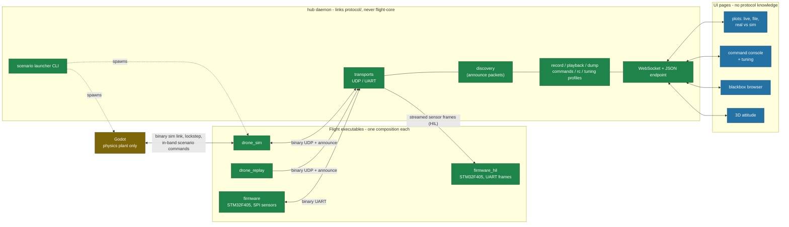

# Target design - functional goals and the architecture that serves them

Status: agreed target picture, not current state. This document describes
where the system is headed and why; it deliberately contains no inventory
of the existing code and no migration plan. Companions:
`docs/architecture.md` (flight system fundamentals),
`docs/tooling-architecture.md` (tooling: current state and hub proposal),
`docs/design-audit.md` (findings that motivated several decisions here).

## 1. Mission

A 5-inch drone is thrown by hand with motors off. The firmware detects the
throw, predicts the apex, spins up, recovers attitude and settles into a
stable hover, where the pilot takes over. Everything below serves that
loop: flying it, simulating it, recording it, understanding it, tuning it.

---

## 2. Functional target

### 2.1 Piloting modes

Two throttle interpretations, chosen before arming and locked while armed
(changing mode requires disarming):

- **Manual**: throttle minimum means motors at zero; the stick commands
  thrust directly.
- **Altitude auto**: the stick commands target vertical velocity; stick
  centered (50%) means zero vertical speed, i.e. hold altitude.

The throw sequence requires altitude-auto mode with the throttle centered
(within a deadband) to arm. Rationale: recovery ends in a stabilized hover
(vertical speed zero), so the pilot resumes control through a command that
is continuous with the drone's actual state - no handoff discontinuity by
construction.

Every threshold in the arming and mode logic carries hysteresis or a
deadband; no boundary may chatter at frame rate.

The kill switch is unchanged and non-negotiable: a frame field, handled
first in `step()`, defaulting to safe, with RC silence meaning kill.

### 2.2 In-flight robustness

- `step()` has a defined contract for invalid input: NaN/Inf fields,
  non-monotonic timestamps and implausible sensor values (a zeroed baro
  above all) must have specified, tested behavior - never silent
  propagation to the motors.
- The RC fail-safe logic runs through the same code path in simulation
  and on the board, so every simulated flight exercises the code that
  guards the real one.
- On target: a watchdog covers the flight loop, fault handlers stop the
  motors before anything else, and bus errors escalate through a policy
  (bounded stale-data tolerance, then fail-safe) instead of silently
  reusing the last sample.

### 2.3 Dynamic tuning

Controller and estimator gains are tunable at runtime, without
reflashing:

- flight-core owns a static parameter table (id, value, bounds); no
  dynamic allocation.
- The protocol exposes set / get / list with acknowledgement; changes
  apply between two `step()` calls, never during one.
- Each parameter declares whether it may change while armed (rate gains
  during bring-up: yes; safety thresholds: no).
- The ground side owns profiles: the hub stores named parameter sets and
  pushes them to the board on connection. On-board flash persistence is
  optional and can come later.
- The same table is the entry point for offline work: re-execution sweeps
  and batch campaigns vary parameters through it, without recompiling.

### 2.4 Blackbox

The blackbox is the system's memory and the foundation of everything
offline. Functions and their owners:

| Function | What it is | Where it lives |
| --- | --- | --- |
| Record | Log the flight at full rate | flight process, via a platform sink (SD/flash on target, file in sim) |
| Dump | Get a recording off the board | firmware command streaming over UART; the hub writes the file PC-side |
| Playback | Inspect the curves of a past flight | hub/pages: load the file, scroll, zoom |
| Re-execution | Run recorded inputs through a modified flight core | `drone_replay` on desktop; frames streamed to the HIL firmware for on-target timing checks |
| Fidelity check | Compare the simulated plant against reality | hub/pages: replay recorded actuator outputs in the simulator, compare sensor traces (see 2.5) |

Content: **sensor frames (inputs) and actuator outputs**, at full rate.
Controller internals may join later for logic debugging; the record format
must allow that from day one: each record carries a sync marker, a type
byte and a CRC, so new record types never break existing decoders, torn
writes (power loss on impact) cost only the damaged record, and old logs
stay readable forever.

Recording inputs is what makes the rest possible: a telemetry log only
allows playback; a sensor log allows all five functions.

### 2.5 Simulation

The simulator is a physics plant, not a cockpit and not a dashboard. Three
distinct guarantees, in increasing order of ambition:

- **Determinism (lockstep)**: the simulator advances only after the
  flight process answers; runs are exactly repeatable step by step.
- **Reproducibility**: same seed + same build = same trajectory. Batch
  results carry a trajectory hash so reproducibility is verified, not
  assumed. Requirements: scenario commands travel in-band on the lockstep
  link (tick-stamped), the sensor-noise RNG reseeds per run from the run
  seed, and a run with lockstep timeouts is flagged or failed, never
  silently free-running.
- **Fidelity**: the plant model (mass, inertia, later thrust and drag)
  matches the real airframe well enough that a controller tuned in
  simulation behaves the same on the real drone. The verification loop:
  record a real maneuver (blackbox), replay the recorded actuator outputs
  through the simulated plant, compare simulated sensor traces against
  the recorded ones. This works before a full airframe exists - a bare
  board can be shaken and thrown onto a mattress, modeled and matched.

Fidelity is a first-class, tooled function: the compare view is a
standard page, and model parameters are data, not code.

### 2.6 Ground operations

- **One command per scenario**: a launcher starts the right set of
  processes with consistent settings (simulated flight, real board over
  UART, replay, batch campaign). Batch campaigns use the same launcher
  as interactive sessions.
- **No hand-wired ports**: flight processes announce themselves; the
  ground side discovers whoever is alive and reconnects on its own.
- **Live monitoring**: plots of estimated state against ground truth
  (sim) or against nothing (real flight, until a reference exists),
  attitude in 3D, link health (sequence-derived loss rates).
- **Operations**: command console (arm, reset, reboot), RC piloting,
  tuning profiles, blackbox browsing and comparison.
- **Anywhere**: the same pages render in a browser, in the editor, or on
  a field laptop next to the drone; no editor required to operate.

---

## 3. Architecture

### 3.1 The dependency rule

One rule generates most of the structure, stated from the inside out:

- **flight-core depends on nothing.** Not on platform implementations,
  not on protocol/. The telemetry packer and the blackbox writer are IO
  adapters and live in platform; flight-core exposes state through
  accessors and never sees a wire layout. It rebuilds only when the
  algorithms change.
- **platform speaks protocol/** to move frames, telemetry, commands and
  blackbox records across process and transport boundaries.
- **External processes speak only protocol/** (simulator, bridges), over
  UDP or UART, and never link flight code.
- **Humans speak to the hub.** The hub is the single process that decodes
  the binary protocol on behalf of people; everything above it is JSON
  over one WebSocket endpoint.

### 3.2 The trust boundary at step()

Validity is layered where the knowledge is:

- **platform stamps what it knows**: a sensor read that failed (bus
  error, timeout) marks the corresponding channel invalid in the
  SensorFrame instead of shipping a stale or zeroed value silently.
- **flight-core judges what only it can**: dt and monotonicity are
  derived once at the top of `step()` and passed down (no per-module
  timestamp arithmetic); NaN/Inf are scrubbed at entry; plausibility
  gates (baro innovation, accel norm, gyro quiet) reject what a healthy
  sensor cannot produce.
- The `step()` contract documents the behavior for every invalid-input
  class, and each class has a test.

### 3.3 Protocol

Fixed-size packed structs, kept deliberately: fixed frames give zero-copy
decode, compile-time layout checks, deterministic UART/DMA framing and a
bandwidth budget that never depends on the values transported. On a local
link owned end to end, bytes are cheap and determinism is not.

Target wire format properties:

- **Version byte then type byte** on every packet; nothing is ever
  demultiplexed by size.
- **Source identity and sequence number** on every stream, so multiple
  senders coexist and loss is measurable.
- **CRC** on serial framing (the blackbox dump path above all); XOR-class
  checksums are not enough for the forensic record.
- **Announce packet**: process kind, ports, protocol version, broadcast
  periodically; the basis of discovery.
- **Command set**: arm/reset/reboot, RC with the mode field (2.1), tuning
  set/get/list with ack (2.3).
- **The blackbox record format lives in protocol/**, versioned with
  everything else - it crosses process boundaries like any other wire
  format.
- Layout is asserted at compile time (sizes, offsets where they matter,
  little-endianness), and **golden-packet fixtures** guarantee the
  non-C++ consumers: reference bytes with asymmetric field values are
  generated from the C++ structs and checked into the repo; every
  hand-written parser must decode them exactly in CI.

### 3.4 Command paths: two kinds, never mixed

- **Interactive RC and commands** travel out-of-band, from the hub to the
  flight process, through `AbsCommandReceiver` - in every composition,
  simulator included. The fail-safe (silence means kill) is therefore
  exercised in every simulated flight.
- **Scenario commands** (reset, throw, scripted arming for campaigns)
  travel in-band on the lockstep sim link, tick-stamped, so batch runs
  are reproducible by construction. Batch tooling never emits RC and
  never touches an RC port: a campaign cannot, structurally, stream
  commands at a real board on the bench.

### 3.5 The hub

One desktop C++ process, in this repo, linking protocol/ headers directly
(zero schema duplication, packet changes break it at compile time) and
never linking flight-core (re-execution belongs to flight executables).
Roles: transports (UDP, serial), discovery, recording, playback, blackbox
dump client, command/RC/tuning forwarding, profile storage, and the
scenario launcher CLI. Human-facing surface: a single WebSocket + JSON
endpoint serving any number of simultaneous clients.

### 3.6 UI pages

Thin web pages over the hub endpoint: plots (live, from file, real vs
sim), command console with tuning profiles, blackbox browser, 3D attitude
(rendered from the telemetry quaternion; the physics engine is not a
renderer for the ground station). Pages know no ports and no packed
structs, and are individually replaceable. The editor is packaging, not
architecture: the same pages render in a browser tab, an editor webview,
or a field laptop.

### 3.7 The simulator

Godot is the plant: rigid-body physics, sensor models (noise, bias,
latency), throw scenarios, and the one latency-critical binary link -
the lockstep sensor/actuator exchange with the flight process. It parses
no telemetry, renders no dashboards and captures no pilot input; those
are hub and pages concerns. Plant parameters (mass, inertia, sensor
noise) are data, so fidelity work (2.5) edits a model, not a script.

### 3.8 Compositions: one per executable, chosen at compile time

Each executable is flight-core plus one composition of platform services,
assembled in an App class; composition is a compile-time decision, one
CMake target per composition, no runtime source switching and no internal
platform `#ifdef`. A flight binary ships no dead code and has no "wrong
source selected" failure mode.

| Executable | Sensor source | Sink / links | Purpose |
| --- | --- | --- | --- |
| `firmware` | SPI/I2C sensors | motors, UART telemetry + blackbox | real flight |
| `firmware_hil` | frames over UART | motors optional, UART telemetry | on-target timing with recorded or simulated data |
| `drone_sim` | UDP sim link (lockstep) | UDP telemetry | development flights against the plant |
| `drone_replay` | blackbox file | UDP telemetry | re-execution of recorded flights on desktop |

Files are a PC concept: the board never reads a file. For on-target
re-execution the hub selects the file and streams frames over UART; the
SD card is write-only (record, then dump). Recorded real throws also
become unit-test fixtures, so re-execution exists in three forms: an app,
a HIL stream, and regression tests.

### 3.9 Verification woven into the architecture

The guarantees above are only real if something checks them continuously:

- protocol layout: static asserts in C++, golden-packet decode tests for
  every non-C++ parser.
- cross-language integration: one headless single-run batch in CI proves
  the C++/GDScript wire compatibility end to end.
- reproducibility: the trajectory hash in batch results.
- `step()` contract: a test per invalid-input class (NaN, backwards
  timestamps, baro glitches, kill mid-phase).
- the hub and pages are part of the tested surface, not a blind spot that
  replaces the previous one.
