# Tooling architecture - current state and proposal

Status: implemented (hub, wire v12, web pages all delivered). Companion to
`docs/architecture.md` (which describes the flight system itself); this
document covers the ground tooling around it: simulator, bridges and
process orchestration.

## Why a hub

Before it, every consumer of the wire re-implemented the binary decoding by
hand: nine parsers across three languages, one hardcoded UDP port per edge,
and every process started by hand with matching arguments. A packet change
broke those parsers silently at runtime, Godot carried visualization and
input duties that do not belong to a physics engine, and a test session
meant launching three or more processes with consistent arguments.

## Proposal - one hub, one binary boundary, thin UI clients

Green = compile-checked against the generated `protocol/` codec. The hub is
the single process that speaks the binary protocol on behalf of humans;
everything above it is JSON over one WebSocket endpoint and knows nothing
about ports or wire messages.

```mermaid
flowchart LR
    subgraph flight["Flight executables - one composition each"]
        FW["firmware<br/>STM32F405, SPI sensors"]
        DS["drone_sim"]
    end

    GODOT["Godot<br/>physics only<br/>(viz/input scripts deleted)"]

    subgraph hub["hub daemon - links protocol/ directly, zero duplication"]
        TR["transport node (UDP),<br/>board through<br/>the WiFi bridge"]
        DISC["discovery<br/>from the beacons the<br/>transport hears, no port wiring"]
        SVC["commands / rc<br/>tuning profiles"]
        WS["single WebSocket + JSON<br/>endpoint"]
        TR --- DISC --- SVC --- WS
    end

    subgraph ui["UI clients - no protocol knowledge, no ports"]
        P1["plots window<br/>live"]
        P2["control window<br/>commands + 3D attitude"]
    end

    BROWSER["opened in a browser,<br/>VSCode Simple Browser,<br/>or a thin extension later"]

    GODOT <-->|"binary sim link kept direct<br/>(lockstep, latency-critical)"| DS
    DS <-->|"transport frames over UDP<br/>(beacon, telemetry, commands)"| TR
    FW <-->|"framed binary over the WiFi bridge"| TR
    WS <--> P1
    WS <--> P2
    ui --- BROWSER

    classDef checked fill:#1e8449,color:#fff,stroke:#145a32
    classDef thin fill:#2471a3,color:#fff,stroke:#1a5276
    classDef neutral fill:#7d6608,color:#fff,stroke:#4d3c04
    class FW,DS,TR,DISC,SVC,WS checked
    class P1,P2,BROWSER thin
    class GODOT neutral
```

Structural improvements, one by one:

- Binary parser count: 9 hand-written files -> codecs generated from one
  schema, and 1 process that decodes them on behalf of humans.
- Human-facing surface: 6 UDP ports -> 1 WebSocket endpoint; UI pages are
  protocol-agnostic and replaceable one by one.
- Port wiring replaced by discovery: every process is a node of the
  shared transport (`software/components/transport/`), beacons its
  announce packet (process kind, protocol version) once per second on the
  one discovery port, and the hub commands it by node id; nobody
  configures an address.
- Roles untangled: Godot is a plant model again; decoding and routing are
  hub features instead of separate processes.
- VSCode becomes packaging, not architecture: the same pages render in a
  browser, in the editor, or on a field laptop through the ESP32 bridge.

## Composition rule: one composition = one CMake target

Service composition is decided at compile time, everywhere. An App class
holds its services as value members (declaration order = construction
order); choosing a sensor source at runtime would mean shipping dead code
in the flight binary and adding a "wrong source selected" failure mode.
So: no runtime source switch, no internal `#ifdef` - one composition root
per variant, one target per composition.

- Desktop: `drone_sim`, one composition around the UDP sim link source.
- Target: `firmware` (SPI sensors, minimal flight composition) and, when
  the need arrives, `firmware_hil` (sensor frames received over UART).

## Alternatives considered and rejected

- **Protobuf / nanopb for the wire protocol.** Solves multi-language
  duplication, and nanopb is proven on STM32-class targets. Rejected at
  first for the properties it trades away (fixed frame sizes, zero-copy
  decode, compile-time layout checks), then adopted once the third
  consumer language and the third hand copy of every struct made the
  duplication the larger cost: one `mark4.proto`, nanopb on every C/C++
  target, godobuf for the plant, protoc for python, and a hash of the
  schema in every announce so a stale build is visible instead of silent
  (`software/components/protocol/README.md`).
- **Shared library + FFI instead of a hub daemon** (protocol stack built
  as a `.so` loaded by the UI host process). Removes duplication just as
  well, but couples the tooling to one host runtime (Node/VSCode), and
  loses the two properties the daemon buys: several UIs watching the same
  stream at once, and field use from a plain browser without the editor.
  Justified when the tooling node must participate in a routing fabric;
  here it only listens to UDP.
- **Embedding the Godot viewport in the tooling UI** (web export or frame
  streaming). Gimmick with real pain (no UDP in web exports, WASM
  weight). Godot stays a separate window; the 3D attitude view only needs
  a quaternion and is rendered with three.js.
