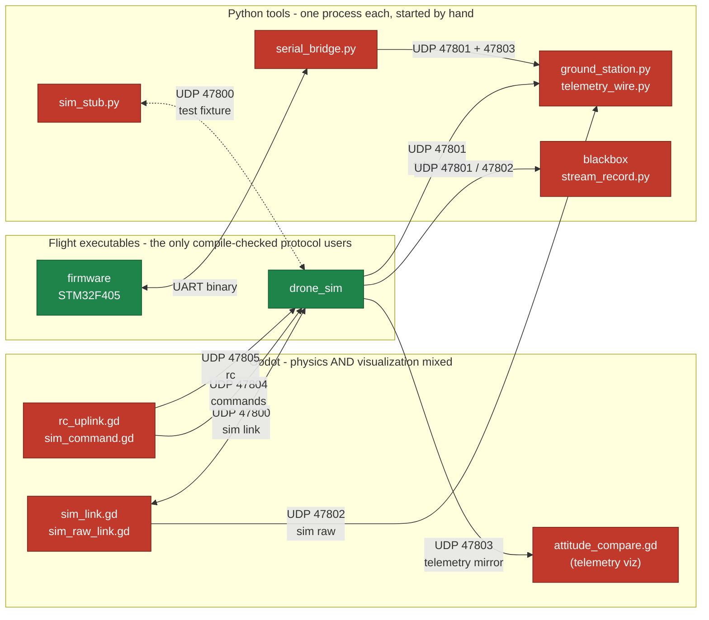
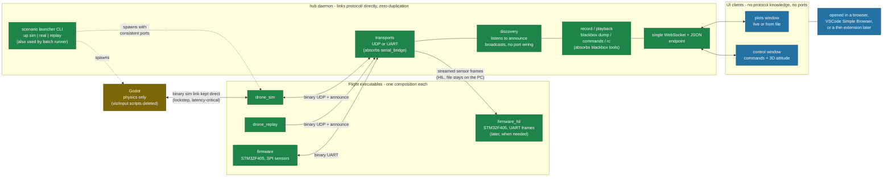

# Tooling architecture - current state and proposal

Status: implemented (hub, wire v12, web pages all delivered). Companion to
`docs/architecture.md` (which describes the flight system itself); this
document covers the ground tooling around it: simulator, ground station,
bridges, blackbox handling and process orchestration.

## Current state - point-to-point binary links, one parser per consumer

Red nodes re-implement the binary protocol decoding by hand (9 files across
3 languages). Every edge is a hardcoded UDP port; every process is started
by hand with matching arguments.

Since captured, `serial_bridge.py` and `stream_record.py` have been deleted:
the hub owns the UART and the stream recording. The scenario launcher role
was later removed again: the hub is a pure server, `run_batch.py` spawns its
own godot+drone_sim pairs and bench sessions start the two by hand (the hub
only ever spawns `drone_replay` for re-execution). `sim_command.gd` and
`rc_uplink.gd` were
deleted too: scenario commands ride the lockstep link in-band (wire v12) and
interactive RC flows through the hub websocket. Finally the web pages landed
(served by the hub over HTTP on the websocket port; since reorganized
into two windows, control and plots)
and `ground_station.py`, `blackbox_dump.py`, `stream_compare.py`,
`read_serial.py`, `attitude_compare.gd` and the 47803 telemetry mirror port
were all deleted; `telemetry_wire.py` moved to `tools/`. The picture below
is the state this proposal was written against.

Pain points made visible:

- 7 hardcoded ports (47800-47805 + 48000 for batch), each repeated in 2-4
  files of different languages.
- 9 hand-written parsers of the packed structs (Python x4, GDScript x5);
  a packet change breaks them silently at runtime.
- Godot carries visualization and input duties that do not belong to a
  physics engine.
- A test session means launching 3+ processes with consistent arguments.

## Proposal - one hub, one binary boundary, thin UI clients

Green = compile-checked against `protocol/` headers. The hub is the single
process that speaks the binary protocol on behalf of humans; everything
above it is JSON over one WebSocket endpoint and knows nothing about ports
or packed structs.

Structural improvements, one by one:

- Binary parser count: 9 hand-written files -> 1 process that includes
  `protocol/` and breaks at compile time on any packet change.
- Human-facing surface: 6 UDP ports -> 1 WebSocket endpoint; UI pages are
  protocol-agnostic and replaceable one by one.
- Port wiring replaced by discovery: flight processes periodically
  broadcast a small announce packet (process kind, ports, protocol
  version); the hub finds whoever is alive and reconnects on its own.
- Roles untangled: Godot is a plant model again; the UART bridge and the
  blackbox scripts become hub features instead of separate processes.
- Startup: one launcher command per scenario instead of hand-wiring
  processes and port arguments.
- VSCode becomes packaging, not architecture: the same pages render in a
  browser, in the editor, or on a field laptop through the ESP32 bridge.

## Blackbox functions and where they live

"Replay" hides several different jobs. Separating them is what dictates
the solution shape:

| Function | What it is | Where it lives |
| --- | --- | --- |
| Record | Log sensor frames (inputs) in flight, full rate | firmware feature (SD/flash, write-only) or platform log sink in sim |
| Dump | Get the recording off the board | firmware command that streams the log over UART; the hub writes the file PC-side |
| Playback | Look at the curves of a past flight | hub/pages feature: load the file, scroll, zoom; no real-time re-streaming needed |
| Re-execution | Run recorded sensor frames through a modified flight core | a flight executable: `drone_replay` on desktop, or streamed to `firmware_hil` for on-target timing checks |

Two structural consequences:

- The blackbox records **inputs** (SensorFrames, plus actuator outputs for
  comparison), not telemetry. A telemetry log only allows playback; a
  sensor log allows all four functions. This drives the on-board format.
- Re-execution is the one function that must link flight-core, so it can
  never live in the hub (whose whole point is to not link flight-core) nor
  in the on-board flight build (it must run modified code, on desktop,
  under sanitizers). Recorded real throws are also meant to become unit
  test fixtures: regression tests of the detectors against real data.

## Composition rule: one composition = one CMake target

Service composition is decided at compile time, everywhere. An App class
holds its services as value members (declaration order = construction
order); choosing a sensor source at runtime would mean shipping dead code
in the flight binary and adding a "wrong source selected" failure mode.
So: no runtime source switch, no internal `#ifdef` - one composition root
per variant, one target per composition.

- Desktop: `drone_sim` (UDP sim link source) and `drone_replay` (file
  source) stay two separate executables. The launcher makes the binary
  count a non-issue.
- Target: `firmware` (SPI sensors, minimal flight composition) and, when
  the need arrives, `firmware_hil` (sensor frames received over UART).
- Files are a PC concept. The board never reads a file to replay it: for
  on-target re-execution the hub selects the file, paces it and streams
  the frames over UART. The SD card is write-only (record, then dump).

## Alternatives considered and rejected

- **Protobuf / nanopb for the wire protocol.** Solves multi-language
  duplication, and nanopb is proven on STM32-class targets. Rejected here
  because it trades away the current protocol's best properties: fixed
  frame sizes (varint encoding makes size depend on values, so the link
  can saturate exactly during dynamic phases), zero-copy decode into
  packed structs, `static_assert` layout checks at compile time, and
  deterministic UART/DMA framing. Worth it for 100+ message types in 3+
  consumer languages; not for this protocol's handful of packet types.
  The hub-links-protocol/ approach removes the duplication without the
  trade. If a schema language ever becomes necessary, fixed-size formats
  or a small in-repo generator fit better.
- **Shared library + FFI instead of a hub daemon** (protocol stack built
  as a `.so` loaded by the UI host process). Removes duplication just as
  well, but couples the tooling to one host runtime (Node/VSCode), and
  loses the two properties the daemon buys: several UIs watching the same
  stream at once, and field use from a plain browser without the editor.
  Justified when the tooling node must participate in a routing fabric;
  here it only listens to UDP and a serial port.
- **Embedding the Godot viewport in the tooling UI** (web export or frame
  streaming). Gimmick with real pain (no UDP in web exports, WASM
  weight). Godot stays a separate window; the ground-station 3D attitude
  view only needs a quaternion and is rendered with three.js.

## Migration path

Each step is useful on its own and none blocks the previous ones:

1. **Centralize the port defaults** in one place under `protocol/` and add
   a scenario launcher (CLI). Immediate relief on startup pain; the batch
   runner becomes a consumer of the same launcher.
2. **Hub daemon, routing first**: telemetry/sim-raw ingest, UDP and UART
   transports (absorbs `serial_bridge.py`), recording, single WebSocket +
   JSON endpoint. Add the announce packet to `protocol/` and drop the
   hand-wired ports.
3. **Web pages one by one**: plots first (parity with `ground_station.py`,
   live and from file), then command console, RC, blackbox browser, 3D
   attitude. Delete the Godot visualization/input scripts and the Python
   tools as pages cover them.
4. **Optional thin VSCode extension** at the end: a tree view calling the
   launcher CLI plus webviews pointing at the hub pages. No protocol
   knowledge, no business logic in the extension.
